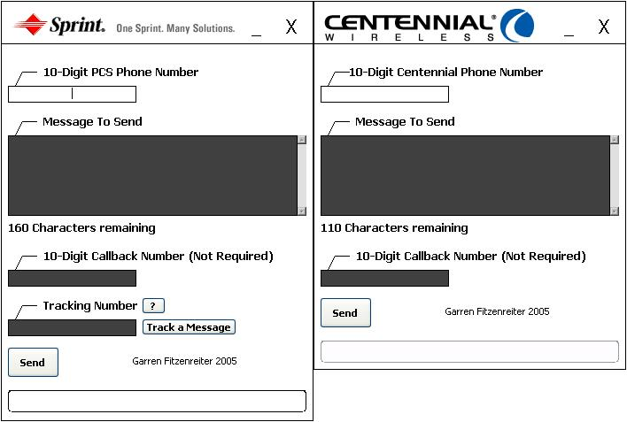



## SprintPCS and Centennial Cell Phone Message Senders

### Description

Have a SprintPCS or Centennial cell phone that supports notifications? If you do, you are going to love this source. Both projects come with an easy-to-use user control designed by me. A user-friendly interface, as well as a help file, makes this program very easy to use. Track a SprintPCS message with the tracking feature. Modify/customize the source to fit your needs in any way. All I ask is that you give me credit for the PCS and Centennial user control made by me if you use them in any of your projects.
 
### More Info
 

             |
---                |---
**Submitted On**   |2005-01-31 22:25:18
**By**             |[keith\_escalade](https://github.com/Planet-Source-Code/PSCIndex/blob/master/ByAuthor/keith-escalade.md)
**Level**          |Advanced
**User Rating**    |5.0 (25 globes from 5 users)
**Compatibility**  |VB 6\.0
**Category**       |[Internet/ HTML](https://github.com/Planet-Source-Code/PSCIndex/blob/master/ByCategory/internet-html__1-34.md)
**World**          |[Visual Basic](https://github.com/Planet-Source-Code/PSCIndex/blob/master/ByWorld/visual-basic.md)
**Archive File**   |[SprintPCS\_184650212005\.zip](https://github.com/Planet-Source-Code/keith-escalade-sprintpcs-and-centennial-cell-phone-message-senders__1-58607/archive/master.zip)

